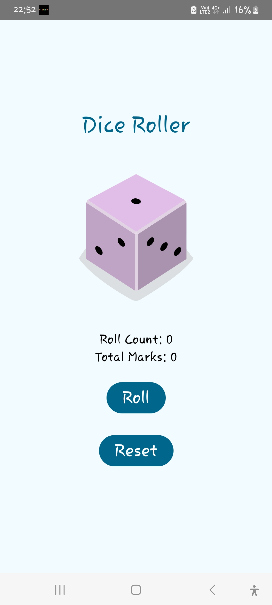
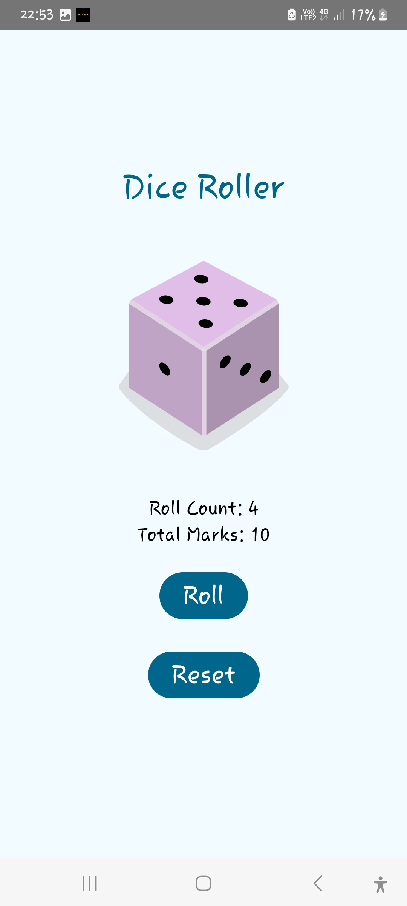

# Dice Roller App 🎲

A simple Android app built using Kotlin and Jetpack Compose that simulates rolling a dice. This app allows users to roll a dice, track the number of rolls, calculate the total marks, and reset the results.

---

## Features

- 🎲 **Dice Roll Simulation**: Roll a six-sided dice and display the result.
- 🔢 **Roll Count Tracking**: Keep track of the total number of rolls.
- ✨ **Total Marks Calculation**: Display the cumulative sum of the dice rolls.
- 🔄 **Reset Option**: Reset the dice result, roll count, and total marks to start over.
- 🖼️ **Dynamic Dice Images**: Dice face updates dynamically based on the roll result.
- 🛠️ **Modern UI**: Uses Jetpack Compose for a responsive and clean user interface.

---

## Screenshots

### Dice Roller App Screenshots

<div style="display: flex; justify-content: space-evenly; align-items: center;">
    <div style="text-align: center; margin-right: 30px;">
        
        <p>Main Screen</p>
    </div>
    <div style="text-align: center;">
        
        <p>After Rolling</p>
    </div>
</div>


## Installation and Setup

1. **Clone the repository**:
   ```bash
   git clone https://github.com/ransikaRan298/Dice_Roller_App.git
